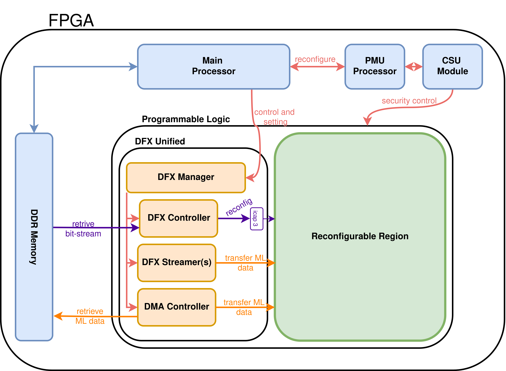

# DFX4ML-ARCH


DFX4ML-ARCH is an FPGA architecture where the FPGA's ML modules autonomously swap its own ML accelerator kernels during execution. Without any CPU involvement in the reconfiguration process, the FPGA loads and replaces partial bitstreams on-chip, enabling large ML models — too big to fit the device at once — to run in full by executing segment by segment across a self-managed reconfigurable region.

**Tested on:** Zynq UltraScale+ (KV260) · Vivado 2023.2 · Ubuntu 22.04 + PYNQ

---

## Table of Contents

- [How It Works](#how-it-works)
- [Project Structure](#project-structure)
- [Quick Start (User)](#quick-start-user)
  - [Requirements](#requirements)
  - [Build and Export](#build-and-export)
  - [HwBuildHelper Parameters](#hwbuildhelper-parameters)
- [Contributor Guide](#contributor-guide)
  - [Naming Conventions](#naming-conventions)
  - [Integrating Your ML Kernel](#integrating-your-ml-kernel)
  - [Adding Board Support](#adding-board-support)
  - [Hardware IP and Driver Overview](#hardware-ip-and-driver-overview)

---

## How It Works

DFX4ML-ARCH splits the FPGA fabric into two regions:

| Region | Role |
|---|---|
| **Static Region** | Always-active control logic: DFX Manager, DFX Controller, DFX Streamer(s), DMA Controller |
| **Reconfigurable Region (RP)** | Swappable ML kernels loaded at runtime via AXI-Stream |




The **DFX Manager** orchestrates the whole flow autonomously: it commands the DFX Controller to load a partial bitstream from DDR into the RP via ICAP3, pre-loads/stores data using the DFX Streamers (on-chip BRAM buffers), and moves bulk data through the DMA Controller — all without host CPU intervention. This self-reconfiguration loop enables a sequential execution pipeline where each ML model segment runs in the RP, then the FPGA reprograms itself for the next segment, until the full model completes.

---

## Project Structure

```
.
+-- hw/                          # Hardware source files
|   +-- bd_src/                  # Vivado block design scripts
|   |   +-- dfx4ml/              # Static & PR connection script
|   |   +-- dfx_region/          # Reconfigurable region block design
|   |   +-- dfx_unified/         # Static region block design
|   +-- build_script/            # Board-specific build scripts
|   |   +-- kv260/               # KV260 board_build.tcl + constraint.xdc
|   +-- ip_src/                  # Verilog IP sources
|       +-- dfx_icap/            # ICAP3 wrapper
|       +-- dfx_mng/             # DFX Manager IP
|       +-- dfx_streamer/        # DFX Streamer (BRAM buffer)
|       +-- dfx_streamer_mshut/  # AXI-Stream master dummy plug
|       +-- dfx_streamer_sshut/  # AXI-Stream slave dummy plug
|       +-- ...
+-- lib/                         # Python build helpers
|   +-- hw_build.py              # HwBuildHelper
|   +-- sw_build.py              # SwBuildHelper
+-- sw/                          # Software / driver sources
|   +-- driver/                  # PYNQ Python drivers
+-- export/                      # Build artifacts (generated)
|   +-- hw/                      # .bin bitstreams, .hwh handoff files
|   +-- driver/                  # Exported PYNQ drivers
|   +-- test.ipynb               # Board-side test notebook
+-- quick_start.ipynb            # Build entry point
+-- doc/tech_report/             # Full technical report (LaTeX)
```

---

## Quick Start (User)

### Requirements

- Xilinx Vivado 2023.2 (or compatible)
- Python 3 with standard library (`subprocess`, `os`, `shutil`, `re`)
- KV260 Starter Kit running Ubuntu 22.04 + PYNQ

### Build and Export

Open `quick_start.ipynb` and configure the parameters below, then run all cells.

```python
from lib.hw_build import HwBuildHelper
from lib.sw_build import SwBuildHelper

hw_builder = HwBuildHelper(
    build_folder_path        = "./build_prj",
    dfx_root_path            = ".",
    board                    = "kv260",
    user_repo_path           = "",          # path to your IP repo; required when test_mode=0
    req_gen_ip               = 1,           # set to 1 on first run or after deleting build_folder_path
    num_core                 = 4,
    clk_frq                  = 99999001,    # Hz (~100 MHz)
    rm_index_width           = 2,
    num_dfx_streamer         = 2,
    interface_widths          = [32, 32],
    applied_interface_widths = [32, 32],
    storage_index_widths     = [10, 10],
    num_actual_rm            = 2,
    input_map_list           = [[0, -1], [-1, 0]],
    output_map_list          = [[-1, 0], [0, -1]],
    ip_map_list              = ["", ""],
    test_mode                = 1,           # set to 0 to use your actual kernel
    vivado_path              = "<absolute path to vivado binary>",
    export_folder_path       = "./export"
)

hw_builder.run_build()
hw_builder.package_export_files()

sw_builder = SwBuildHelper(export_folder_path="./export")
sw_builder.package_export_file()
```

Outputs written to `export/`:
- `hw/system.bin` — full bitstream
- `hw/rm_*.bin` — partial bitstreams (one per RM)
- `hw/system.hwh` — hardware handoff file
- `driver/` — PYNQ Python drivers
- `test.ipynb` — board-side test notebook

### HwBuildHelper Parameters

| Parameter | Description |
|---|---|
| `build_folder_path` | Vivado project and temporary files directory. Created if it does not exist. |
| `dfx_root_path` | Root of this repository. Used to locate IP cores and constraint files. |
| `board` | Target board identifier (`kv260` or `custom`). |
| `user_repo_path` | Path to your Vivado-exported IP folder. Used only when `test_mode=0`. |
| `req_gen_ip` | `1` to regenerate Verilog IPs (ICAP wrapper, DFX Manager, DFX Streamer). **Must be `1` on first run or after clearing the build folder.** |
| `num_core` | Parallel synthesis/implementation jobs in Vivado. |
| `clk_frq` | FPGA clock frequency in Hz (e.g., `99999001` ≈ 100 MHz). |
| `rm_index_width` | Bit-width of the RM index. Determines allocated slots: `2 << rm_index_width`. Actual loaded RMs is `num_actual_rm`. |
| `num_dfx_streamer` | Number of DFX Streamer instances in the static region. |
| `interface_widths` | Bus width (bits) per streamer. Must be powers of 2, minimum 8. |
| `applied_interface_widths` | Effective data width per streamer (may be ≤ `interface_widths` for partial-width transfers). |
| `storage_index_widths` | BRAM address index width per streamer. Depth = `2^w` entries. |
| `num_actual_rm` | Number of RMs loaded at runtime. |
| `input_map_list` | Per-kernel input routing. `input_map_list[kernel_id][streamer_id]` = kernel input port ID, or `-1` if not connected. |
| `output_map_list` | Per-kernel output routing. Same structure as `input_map_list` but for output ports. |
| `ip_map_list` | Per-kernel IP core name strings. Empty string = no additional IP for that slot. |
| `test_mode` | `1` inserts loopback logic for hardware verification. `0` uses your actual kernel from `user_repo_path`. |
| `vivado_path` | Absolute path to the Vivado binary (e.g., `/tools/Xilinx/Vivado/2023.2/bin/vivado`). |
| `export_folder_path` | Destination for packaged outputs (`.bin`, `.hwh`, drivers). Created if it does not exist. |

---

## Contributor Guide

> For full architectural details, register maps, state machine descriptions, and driver internals, read the technical report at [doc/tech_report_v0.1.tex](doc/tech_report/main.tex).


### Naming Conventions

- **Python classes and Verilog module names** use `Pascal_Snake_Case` (e.g., `Hw_Build_Helper`, `Dfx_Streamer`).
- **Python variables and methods** use `snake_case` (e.g., `build_folder_path`, `run_build()`).

Some legacy modules predate this convention; a refactoring pass is planned for a future minor version.

### Integrating Your ML Kernel

To plug in a real ML kernel instead of the loopback test logic, set `test_mode=0` and provide:

1. Your Vivado-exported IP folder (must contain `src/` and `xgui/`) via `user_repo_path`.
2. A **User Build TCL file** that defines the `create_dfx_region_bd` procedure — this is how the build script instantiates your kernel inside the Reconfigurable Module block design.
3. The IP name string(s) in `ip_map_list`.

Use [hw/bd_src/dfx_region/dfx_region.tcl](hw/bd_src/dfx_region/dfx_region.tcl) as a reference implementation. The `create_dfx_region_bd` procedure signature, its arguments, and the AXI-Stream wiring requirements (`tkeep` and `tlast` are mandatory) are documented in detail in the technical report (§ Build Procedure — ML Framework Integration).

### Adding Board Support

Only `kv260` is fully supported. Setting `board="custom"` stops the build after the DFX block design (PS and interconnect are absent).

To add a new board, three files are needed:

1. `hw/build_script/<board_name>/board_build.tcl` — processor block, interconnect, and board-specific IPs.
2. `hw/build_script/<board_name>/constraint.xdc` — reconfigurable region boundaries and resource allocation.
3. Edit `hw/build_script/build.tcl` to invoke your board's procedure.

Use the `kv260` files as references. Pull requests adding board support are very welcome.

### Hardware IP and Driver Overview

| IP | Location |
|---|---|
| DFX Manager | [hw/ip_src/dfx_mng/](hw/ip_src/dfx_mng/) |
| DFX Streamer | [hw/ip_src/dfx_streamer/](hw/ip_src/dfx_streamer/) |
| ICAP Wrapper | [hw/ip_src/dfx_icap/](hw/ip_src/dfx_icap/) |
| Stream Dummy Plugs | [hw/ip_src/dfx_streamer_mshut/](hw/ip_src/dfx_streamer_mshut/), [hw/ip_src/dfx_streamer_sshut/](hw/ip_src/dfx_streamer_sshut/) |

| Driver File | Role |
|---|---|
| [sw/driver/dfx_unified.py](sw/driver/dfx_unified.py) | Top-level entry point; composes all sub-drivers |
| [sw/driver/dfx_mng.py](sw/driver/dfx_mng.py) | RM execution flow and register bank |
| [sw/driver/dfx_ctrl.py](sw/driver/dfx_ctrl.py) | Partial bitstream management |
| [sw/driver/dfx_dma.py](sw/driver/dfx_dma.py) | DMA data transfer (debug) |
| [sw/driver/dfx_man.py](sw/driver/dfx_man.py) | Manual decouple/reset of the RP (debug) |

For internal register maps, the DFX Manager state machine, the DFX Unified IP address map, and driver internals, see the technical report.
