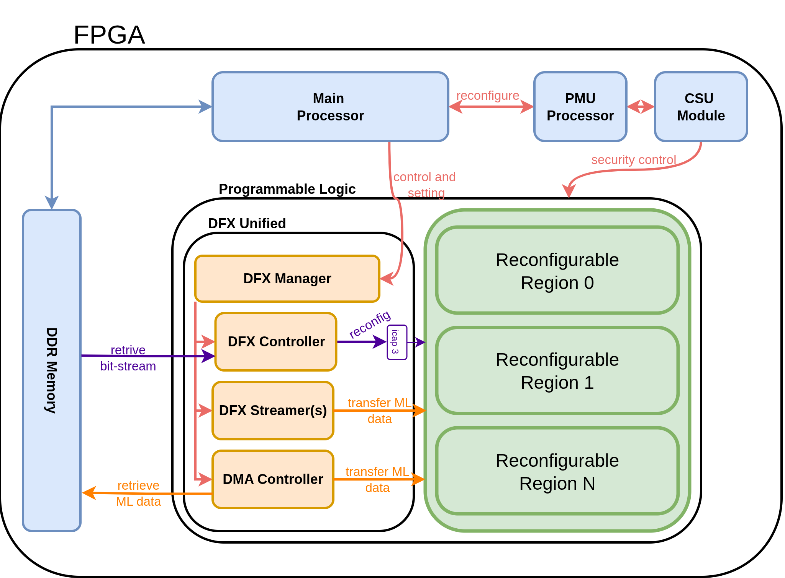

# DFX4ML


DFX4ML is an FPGA architecture where the FPGA's ML modules autonomously swap its own ML accelerator kernels during execution. Without any CPU involvement in the reconfiguration process, the FPGA loads and replaces partial bitstreams on-chip, enabling large ML models — too big to fit the device at once — to run in full by executing segment by segment across a self-managed reconfigurable region.

With **two reconfigurable regions**, DFX4ML **hides the reconfiguration latency**: while one region runs its ML kernel, the other is already being reprogrammed with the next segment's bitstream. The slow on-chip reconfiguration is overlapped with useful compute, so the model streams through back-to-back segments with the bitstream-swap time largely masked behind execution.

**Tested on:** Zynq UltraScale+ (KV260) · Vivado 2023.2 · Ubuntu 22.04 + PYNQ

---

## Table of Contents

- [How It Works](#how-it-works)
  - [Latency Hiding (Two Regions)](#latency-hiding-two-regions)
- [Project Structure](#project-structure)
- [Quick Start (User)](#quick-start-user)
  - [Requirements](#requirements)
  - [Build and Export (Keras → hls4ml → dfx4ml)](#build-and-export-keras--hls4ml--dfx4ml)
  - [HwBuildHelper Parameters](#hwbuildhelper-parameters)
- [Contributor Guide](#contributor-guide)
  - [Naming Conventions](#naming-conventions)
  - [Integrating Your ML Kernel](#integrating-your-ml-kernel)
  - [DFX Streamer Bank Allocation](#dfx-streamer-bank-allocation)
  - [Adding Board Support](#adding-board-support)
  - [Hardware IP and Driver Overview](#hardware-ip-and-driver-overview)

---

## How It Works

DFX4ML splits the FPGA fabric into multiple regions:

| Region | Role |
|---|---|
| **Static Region** | Always-active control logic: DFX Manager, DFX Controller, DFX Streamer(s), DMA Controller |
| **Reconfigurable Region (RP)** | Swappable ML kernels loaded at runtime via AXI-Stream |




The **DFX Manager** orchestrates the whole flow autonomously: it commands the DFX Controller to load a partial bitstream from DDR into the RP via ICAP3, pre-loads/stores data using the DFX Streamers (on-chip BRAM buffers), and moves bulk data through the DMA Controller — all without host CPU intervention. This self-reconfiguration loop enables a sequential execution pipeline where each ML model segment runs in the RP, then the FPGA reprograms itself for the next segment, until the full model completes.

### Latency Hiding (Two Regions)

On-chip partial reconfiguration is slow — loading a bitstream through ICAP3 can dominate the runtime if every segment must wait for its region to finish reprogramming. DFX4ML-ARCH avoids that stall by running **two reconfigurable regions in a ping-pong schedule**:

- While **region A executes** the current segment's kernel,
- **region B is reconfigured** in the background with the next segment's bitstream.

When region A finishes, region B is already loaded and runs immediately while region A reprograms for the segment after that. Because reconfiguration overlaps with execution, the bitstream-swap time is hidden behind compute and the model flows through its segments with minimal idle gaps. The DFX Manager schedules this overlap autonomously via its slot-linked-list (one slot reconfigures a region while another slot executes the other), and the DFX Streamers carry the inter-segment data across the swap. A **single-region** configuration still works (segments run strictly sequentially, reconfigure-then-execute) and is the simpler starting point.

---

## Project Structure

```
.
+-- hw/                          # Hardware source files
|   +-- bd_src/                  # Vivado block design scripts
|   |   +-- dfx4ml/              # Static & PR top-level connection script
|   |   +-- dfx_region/          # Reconfigurable region (RM) block design
|   |   +-- dfx_unified/         # Static region block design
|   +-- build_script/            # Build orchestration
|   |   +-- build.tcl            # Main build orchestrator (board dispatch + DFX runs)
|   |   +-- build_ip_only.tcl    # IP-only (no synthesis) build
|   |   +-- kv260/               # KV260 board_build.tcl + constraint_<N>_region.xdc
|   |   +-- custom/              # Custom-board template scripts
|   +-- ip_src/                  # Verilog IP sources
|       +-- compose_ip.tcl       # Composes all custom IPs into ip_repo/
|       +-- dfx_icap/            # ICAP3 wrapper
|       +-- dfx_mng/             # DFX Manager IP (state machines + register banks)
|       +-- dfx_decup_ctrl/      # PR decoupler control
|       +-- dfx_streamer/        # DFX Streamer (BRAM/URAM buffer)
|       +-- dfx_streamer_s2m/    # Stream <-> memory variants (s2m / s2m_free)
|       +-- dfx_stream_aligner_m2s/, dfx_stream_aligner_s2m/  # AXI-S width aligners
|       +-- dfx_streamer_mshut/, dfx_streamer_sshut/         # AXI-Stream dummy plugs
|       +-- dfx_streamer_mreset/, dfx_streamer_sreset/       # Streamer reset helpers
|       +-- dfx_axi_lite_shut/   # AXI-Lite dummy plug
|       +-- ...
+-- lib/                         # Python build helpers
|   +-- hw_build.py              # HwBuildHelper (hardware build entry point)
|   +-- sw_build.py              # SwBuildHelper (driver/test packaging)
|   +-- dfx_streamer_cal.py      # DFX Streamer bank/group allocation calculator
|   +-- run_build.tcl.template   # Generated Vivado build-script template
|   +-- transfer_to_pynq.sh      # Copy export folder to the board
|   +-- hls4ml_build/            # Hls4ml_build orchestrator (convert/csim/synth/glue/diag)
|   +-- hls4ml_con/              # hls4ml -> dfx4ml backend plugin (VitisUnifiedDFx4ml)
+-- sw/                          # Software / driver sources
|   +-- driver/                  # PYNQ Python drivers (dfx_unified, dfx_mng, dfx_ctrl, ...)
+-- hls4ml/                      # hls4ml source (git submodule)
+-- example/                     # Worked examples + board test notebooks
|   +-- tutorial/                # Board test notebooks + shared quick-start model
|   +-- multi_region_test{2..5}/ # Multi-region pipeline examples
|   +-- query_explore/, exp_dyn_size/, ...  # Exploratory notebooks
+-- export*/                     # Build artifacts (generated; per-part export_part_<N>/)
|   +-- hw/                      # .bin bitstreams, .hwh handoff, dfx_ctrl_con.txt
|   +-- driver/                  # Exported PYNQ drivers
|   +-- data/                    # csim reference arrays
|   +-- *.ipynb                  # Board-side test notebook
+-- quick_start_hls4ml_part_1.ipynb  # Quick start: 1 region, 2 RMs (Keras -> hls4ml -> dfx4ml)
+-- quick_start_hls4ml_part_2.ipynb  # Quick start: 2 regions, 4 RMs (latency hiding)
+-- quick_start.ipynb            # Lower-level build entry point (no hls4ml)
+-- doc/                         # Technical report + experiment logs (LaTeX)
|   +-- tech_report/             # Full technical report
+-- archive/                     # Legacy / superseded experiments
```

---

## Quick Start (User)

### Requirements

- Xilinx Vivado **and** Vitis 2023.2 (or compatible) — Vitis is needed for the hls4ml C-synthesis step
- Python 3 with `hls4ml`, TensorFlow/Keras, and NumPy (plus the standard library); the `hls4ml` submodule must be checked out (`git submodule update --init`)
- KV260 Starter Kit running Ubuntu 22.04 + PYNQ

### Build and Export (Keras → hls4ml → dfx4ml)

The quick-start path is the two end-to-end notebooks. Each takes a trained Keras model, partitions it, runs it through **hls4ml** to generate the user kernels, and drives the full dfx4ml hardware + PYNQ software build — no hand-written TCL or `HwBuildHelper` parameters required. Run them **from the repo root** and edit the `VITIS_PATH` / `VIVADO_PATH` cell to point at your 2023.2 installs.

| Notebook | Topology | What it demonstrates |
|---|---|---|
| [`quick_start_hls4ml_part_1.ipynb`](quick_start_hls4ml_part_1.ipynb) | **1 region, 2 RMs** (`config_2`) | Single-region sequential swap — `halfA`/`halfB` reconfigure-then-execute in one region. The simplest starting point. |
| [`quick_start_hls4ml_part_2.ipynb`](quick_start_hls4ml_part_2.ipynb) | **2 regions, 4 RMs** (`config_4`) | Two-region **latency hiding** — `part1`..`part4` ping-pong across two regions so reconfiguration overlaps execution. |

Each notebook walks through: load the model → set tool paths → describe the partition topology → convert (hls4ml) → C-sim + save reference data → streamer glue → C-synthesis (+ optional FIFO-depth optimization) → Vivado hardware build → PYNQ software build → stage the board test notebook and data into `export_part_<N>/`. The final cell tells you how to copy that folder to the KV260, where you run the matching board notebook (`hls4ml_1_region_2_rm.ipynb` / `hls4ml_2_region_4_rm.ipynb`).

> Both notebooks are driven by the `Hls4ml_build` orchestrator, which ultimately calls `HwBuildHelper` / `SwBuildHelper`. If you want to build a kernel **without** hls4ml — supplying your own exported IP and RM TCL — call `HwBuildHelper` directly; the [HwBuildHelper Parameters](#hwbuildhelper-parameters) table below documents every argument, and `quick_start.ipynb` is the bare-metal reference for that lower-level flow.

Outputs written to `export_part_<N>/`:
- `hw/system.bin` — full bitstream
- `hw/region_<R>_rm_<M>.bin` — partial bitstreams (one per region/RM pair)
- `hw/system.hwh` — hardware handoff file
- `hw/dfx_ctrl_con.txt` — DFX Controller configuration
- `driver/` — PYNQ Python drivers
- `data/` — csim reference arrays (`x_input.npy`, `y_keras.npy`, `y_pred_hls.npy`)
- the matching board-side test notebook

### HwBuildHelper Parameters

| Parameter | Description |
|---|---|
| `build_folder_path` | Vivado project and temporary files directory. Created if it does not exist. |
| `dfx_root_path` | Root of this repository. Used to locate IP cores, build scripts, and constraint files. |
| `board` | Target board identifier (`kv260`, or `custom` to supply `board_build_tcl`/`constraint_xdc` manually). |
| `user_repo_path` | Path to your Vivado-exported IP folder (must contain `src/` and `xgui/`). Used only when `test_mode=0`. |
| `user_rm_build_tcl_path` | Path to your TCL script defining `create_dfx_region_bd`, which builds the RM IP. Used only when `test_mode=0`. |
| `req_gen_ip` | `1` to regenerate Verilog IPs (ICAP interface, DFX Manager, DFX Streamer, DFX Streamer Shut Plug). **Must be `1` on first run or after clearing the build folder.** |
| `num_core` | Parallel synthesis/implementation jobs in Vivado. |
| `clk_frq` | FPGA clock frequency in Hz (e.g., `99999001` ≈ 100 MHz). |
| `rm_index_width` | Bit-width of the RM index field. Allocates `2^rm_index_width` slots in DFX Mng Bank 1 / DFX Ctrl. The actual RM count comes from `rm_schemetics`. |
| `dfx_streamers` | List of streamer config dicts, one per DFX Streamer. **Index 0 is always the DMA pass-through streamer.** Each dict: `load_width`/`store_width` (bus width in bytes, power of 2), `actual_width` (effective data width in bits, ≤ bus width × 8), `amount_row` (BRAM depth in rows). |
| `dfx_regions` | List of region config dicts, one per reconfigurable region. Each dict: `load_streamers` and `store_streamers` — lists of `dfx_streamers` indices that supply/receive data for the region. |
| `rm_schemetics` | 2-D list `rm_schemetics[region_idx][rm_idx]` of RM schematic dicts. Each dict: `load_io_map` and `store_io_map` — lists of `(streamer_index, kernel_port_index)` pairs. All regions must declare the same number of RMs. |
| `test_mode` | `1` inserts loopback logic for hardware verification (no user RM). `0` uses your actual kernel from `user_repo_path`. |
| `vivado_path` | Absolute path to the Vivado binary (e.g., `/tools/Xilinx/Vivado/2023.2/bin/vivado`). |
| `export_folder_path` | Destination for packaged outputs (`.bin`, `.hwh`, `dfx_ctrl_con.txt`, drivers). Created if it does not exist. |
| `board_build_tcl` | *(Optional; required when `board="custom"`)* Path to the board-specific TCL build script. Ignored for known boards. |
| `constraint_xdc` | *(Optional; required when `board="custom"`)* Path to the board-specific XDC constraint file. Ignored for known boards. |

---

## Contributor Guide

> For full architectural details, register maps, state machine descriptions, and driver internals, read the technical report: [tech_report_v1.0_beta.pdf](doc/tech_report_v1.0_beta.pdf) (source: [main.tex](doc/tech_report/main.tex)).


### Naming Conventions

- **Python classes and Verilog module names** use `Pascal_Snake_Case` (e.g., `Hw_Build_Helper`, `Dfx_Streamer`).
- **Python variables and methods** use `snake_case` (e.g., `build_folder_path`, `run_build()`).

Some legacy modules predate this convention; a refactoring pass is planned for a future minor version.

### Integrating Your ML Kernel

To plug in a real ML kernel instead of the loopback test logic, set `test_mode=0` and provide:

1. Your Vivado-exported IP folder (must contain `src/` and `xgui/`) via `user_repo_path`.
2. A **User Build TCL file** (via `user_rm_build_tcl_path`) that defines the `create_dfx_region_bd` procedure — this is how the build script instantiates your kernel inside the Reconfigurable Module block design. Its `ip_name` argument carries the IP core name for each kernel slot.
3. The per-RM I/O routing in `rm_schemetics` (`load_io_map` / `store_io_map`).

Use [hw/bd_src/dfx_region/dfx_region.tcl](hw/bd_src/dfx_region/dfx_region.tcl) as a reference implementation. The `create_dfx_region_bd` procedure signature, its arguments, and the AXI-Stream wiring requirements (`tkeep` and `tlast` are mandatory) are documented in detail in the technical report (§ ML Framework Integration).

### DFX Streamer Bank Allocation

The DFX Streamers are BRAM/URAM buffers that hold inter-partition data while the
RP is reconfiguring. Their main memory packs **4096 entries per bank** so Vivado
can merge banks into a single URAM/BRAM. `lib/dfx_streamer_cal.py` is a
design-time calculator that sizes these buffers for a given partition scheme
**before** you build.

Given the ordered list of inter-partition output streams (each tagged with
`shape`, `precision`, producer `region`, and the `alloc_phase`/`free_phase` it
lives across), `dfx_streamer_report()`:

1. Computes per-stream geometry — banks per entry and queries per bank-group.
2. Packs streams that share geometry and region onto reusable physical streamers,
   freeing a streamer once its `free_phase` passes so the next phase can reuse it.
3. Greedily grows the bottleneck streamer (`mul_factor`) one bank-group at a time
   until the bank budget is exhausted, maximising the buffered query count.

```python
from lib.dfx_streamer_cal import dfx_streamer_report

streams = [
    {"name": "ha_bneck", "shape": (2, 2, 8),  "precision": 16, "region": 0, "alloc_phase": 0, "free_phase": 1},
    {"name": "ha_skip2", "shape": (4, 4, 16), "precision": 16, "region": 0, "alloc_phase": 0, "free_phase": 1},
    {"name": "ha_skip1", "shape": (8, 8, 8),  "precision": 16, "region": 1, "alloc_phase": 0, "free_phase": 1},
]
report = dfx_streamer_report(streams, total_banks=64, amt_phase=1, debug=True)
# -> {"dfx_streamers": [...], "total_banks_used": 64, "min_total_query": 1280}
```

> **Scope:** this scheme supports **1 or 2 reconfigurable regions only** — stream
> `region` tags must be `0` (single region) or `0`/`1` (two regions); anything
> else raises. Ported from the project's HLS partitioning script (formerly
> "magic streamer", now DFX Streamer).

### Adding Board Support

Only `kv260` is fully supported. Setting `board="custom"` stops the build after the DFX block design (PS and interconnect are absent).

To add a new board, three files are needed:

1. `hw/build_script/<board_name>/board_build.tcl` — processor block, interconnect, and board-specific IPs.
2. `hw/build_script/<board_name>/constraint_<N>_region.xdc` — one file per supported region count `<N>`, defining the reconfigurable region boundaries and resource allocation. The build selects the file matching `num_dfx_region` (kv260 ships `constraint_1_region.xdc` and `constraint_2_region.xdc`).
3. Edit `hw/build_script/build.tcl` to invoke your board's procedure.

Use the `kv260` files as references. Pull requests adding board support are very welcome.

### Hardware IP and Driver Overview

| IP | Location |
|---|---|
| DFX Manager | [hw/ip_src/dfx_mng/](hw/ip_src/dfx_mng/) |
| DFX Streamer | [hw/ip_src/dfx_streamer/](hw/ip_src/dfx_streamer/) |
| ICAP Wrapper | [hw/ip_src/dfx_icap/](hw/ip_src/dfx_icap/) |
| Stream Dummy Plugs | [hw/ip_src/dfx_streamer_mshut/](hw/ip_src/dfx_streamer_mshut/), [hw/ip_src/dfx_streamer_sshut/](hw/ip_src/dfx_streamer_sshut/) |

| Driver File | Role |
|---|---|
| [sw/driver/dfx_unified.py](sw/driver/dfx_unified.py) | Top-level entry point; composes all sub-drivers |
| [sw/driver/dfx_mng.py](sw/driver/dfx_mng.py) | RM execution flow and register bank |
| [sw/driver/dfx_ctrl.py](sw/driver/dfx_ctrl.py) | Partial bitstream management |
| [sw/driver/dfx_dma.py](sw/driver/dfx_dma.py) | DMA data transfer (debug) |
| [sw/driver/dfx_man.py](sw/driver/dfx_man.py) | Manual decouple/reset of the RP (debug) |
| [sw/driver/pr_ctrl.py](sw/driver/pr_ctrl.py) | HLS `ap_ctrl_hs` control for each RP region |
| [sw/driver/mem_alloc.py](sw/driver/mem_alloc.py) | CMA allocation, overcommit mode, cache flush before DMA |

For internal register maps, the DFX Manager state machine, the DFX Unified IP address map, and driver internals, see the technical report.

## License

This project is released under an MIT-style license with an added **non-military
use restriction** — see [LICENSE](LICENSE). Note that the field-of-use
restriction means it is *not* an OSI-approved open-source license.

The bundled `hls4ml` submodule is licensed separately under the Apache License
2.0; refer to its own repository for terms.
